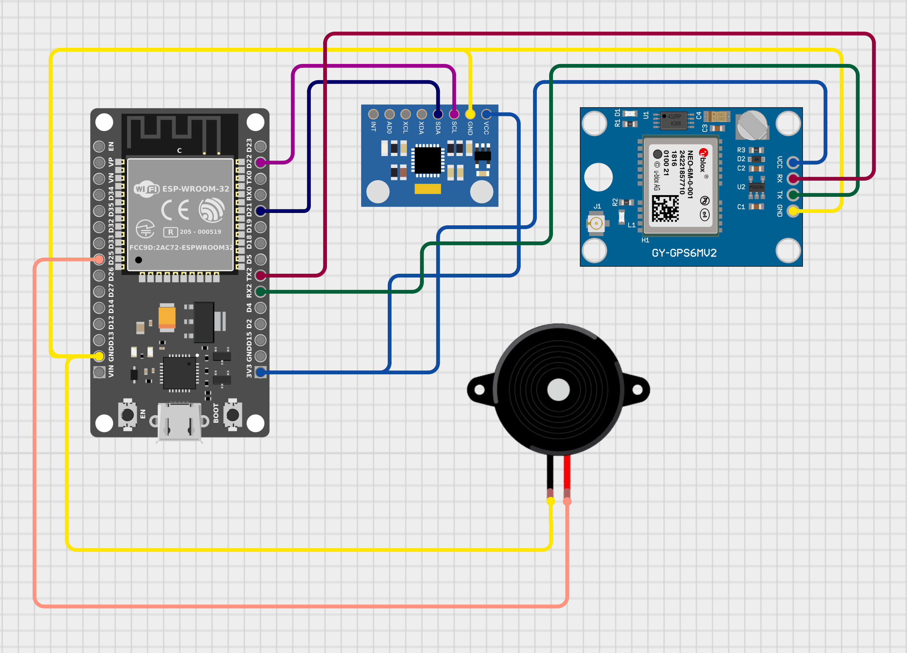

## SUSX - IoT Smart Pothole Detection System

### Project Summary
This project detects pothole impact events from vehicle movement, classifies severity, captures location, and updates a live map dashboard for authorities.

### Circuit Diagram

### Components
1. ESP32 DevKit V1
2. MPU6050 Accelerometer/Gyroscope Module
3. NEO-6M GPS Module
4. Active Buzzer
5. Jumper wires
6. USB cable and power source

### Algorithm
1. Read acceleration values continuously from MPU6050.
2. Compute vertical impact from Z-axis and reject false events using Y-axis filter.
3. If impact crosses threshold and debounce time is satisfied, detect pothole.
4. Classify severity using g-force:
   - Minor: >= 2.0g and < 3.0g
   - Moderate: >= 3.0g and < 5.0g
   - Severe: >= 5.0g
5. Read GPS coordinates (or fallback test coordinates if no GPS fix).
6. Send report to Firebase Realtime Database.
7. If Wi-Fi is unavailable, buffer data locally and upload later.

### Tech Stack
**Hardware**
- ESP32
- MPU6050
- NEO-6M
- Buzzer

**Firmware**
- Arduino C++
- Wire, WiFi, TinyGPSPlus, FirebaseESP32, SPIFFS

**Backend**
- Firebase Realtime Database

**Frontend Dashboard**
- HTML, CSS, JavaScript
- Leaflet.js map
- Firebase Web SDK (Realtime updates)